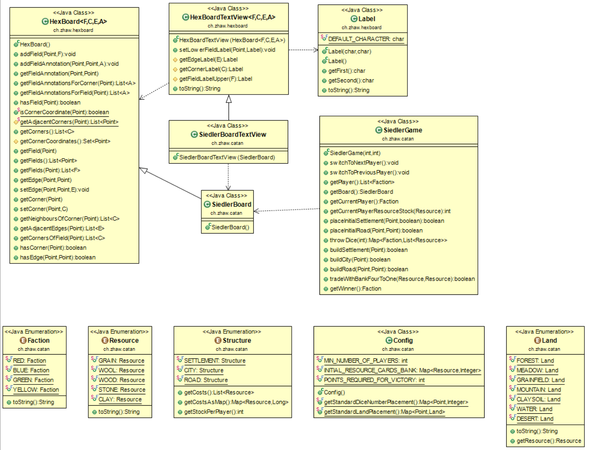
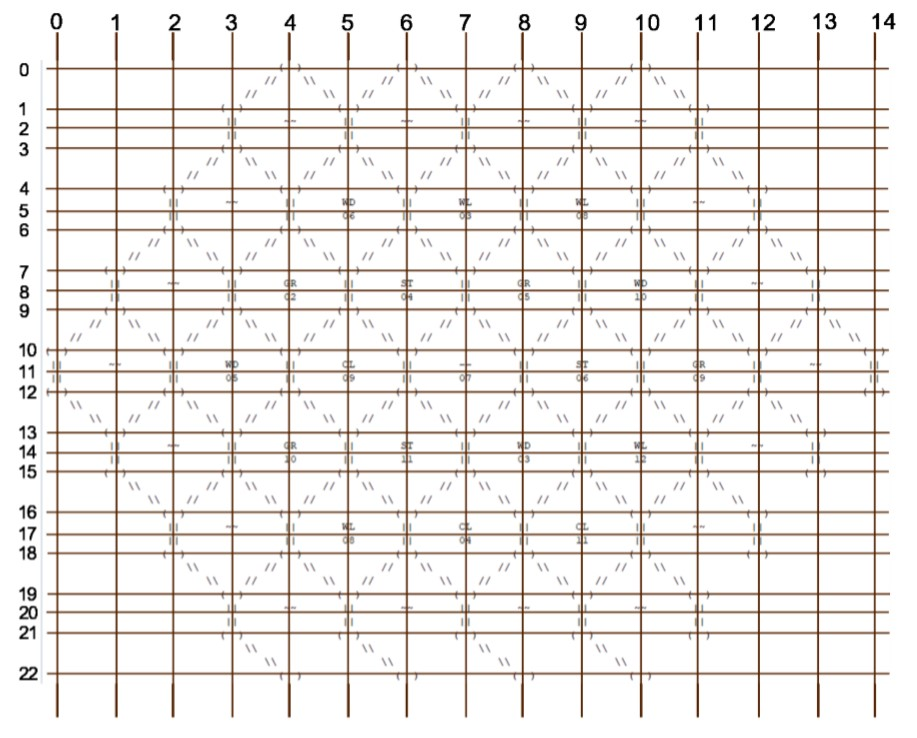
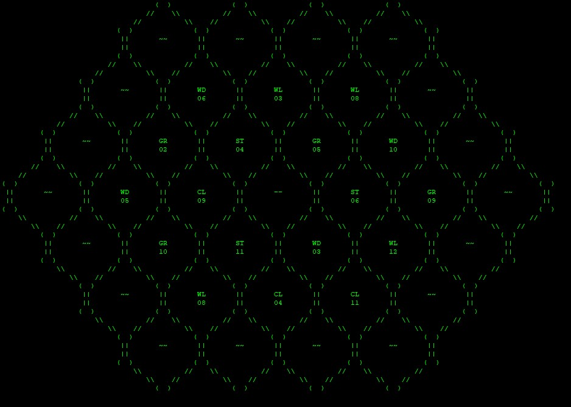

# gruppe103-CaffeineAddicts-projekt1-Siedler

# Project Title

Textbasiertes Siedler von Catan

# Getting Started

Das Projekt wurde ine Eclipse und IntelliJ getestet und funktioniert über den Terminal.

# Team

* **Pascal Witzig** - Head of Development Input and Output aka Assistant Caffeine Addict

* **Oliver Corrodi** - Director of Testing classes and Players aka Chief Caffeine and Nicotine Addict

* **Erman Zankov** - First Executive Programmer specialized in second phase operations aka Longboi

* **Tobias Ritscher** - Senior Software Engineer in Logic Departement and first phase operations aka Diseased Penguin

# License

This project is licensed under the ZHAW License - see [ZHAW](http://www.zhaw.ch) for details

# Manual

## First Phase
The game starts by asking you how many players will be playing.
Each player puts a settlement and a road on the map. Then in reverse order each player puts another settlement and a road on the map. In the final step each player recieves one resource per field that they are next to.

## Second Phase

Each player rolls a dice and all players that are next to a field with the corresponding dice number receive a resource from that field.
Then the player that rolled has options to build a new settlement, replace a settlement with a city, build a road, trade with the bank, end their turn or end the game entirely.

## End Goal

Each settlement gives you a point and each city gives you two points. The first player to reach 7 points wins the game.

## Quick Game

If you want to play a quick game you need to chosse the Option 420 at the start and two players will have already placed settlements and roads. You can start playing the second phase at that point.

# Class Diagram

# Screenshot

